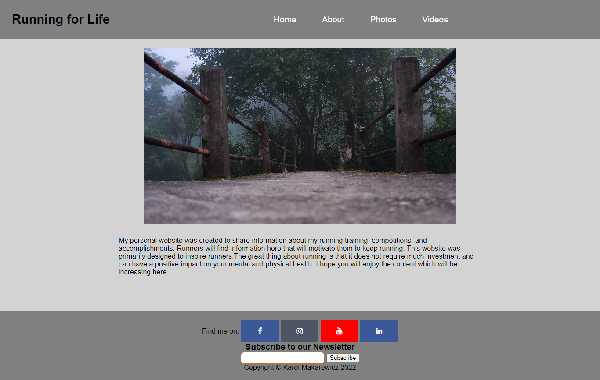
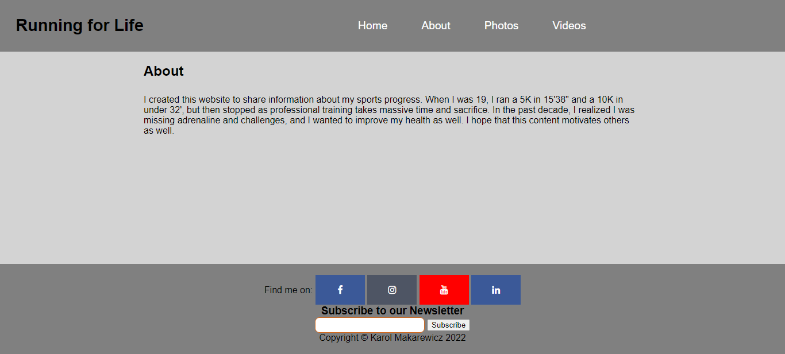
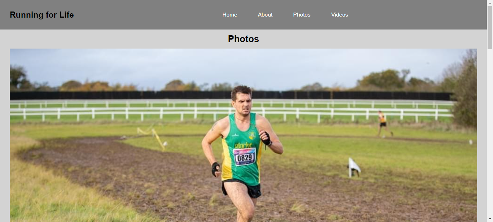
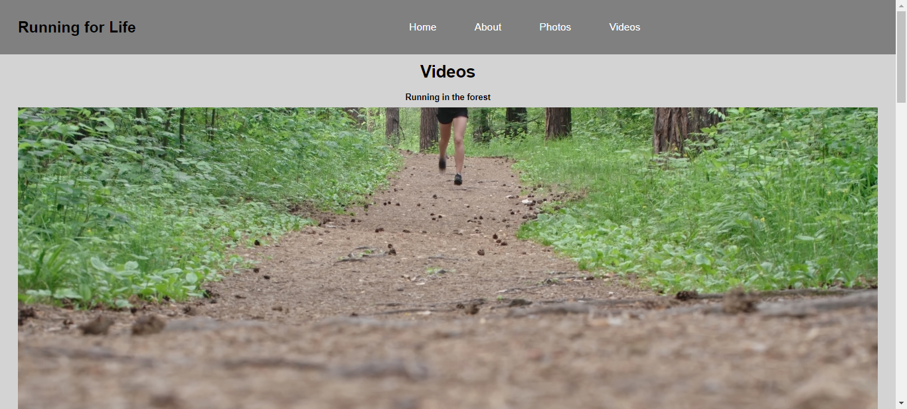
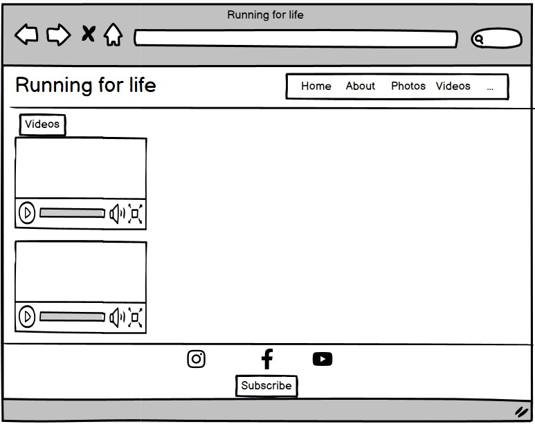
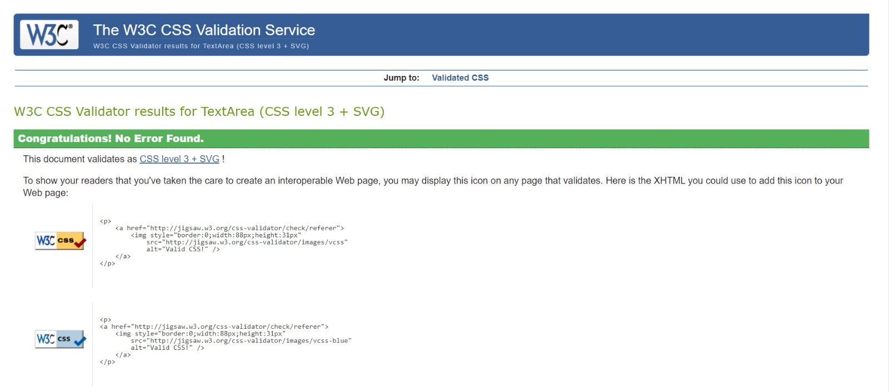
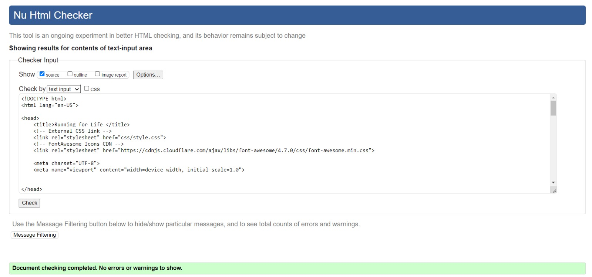
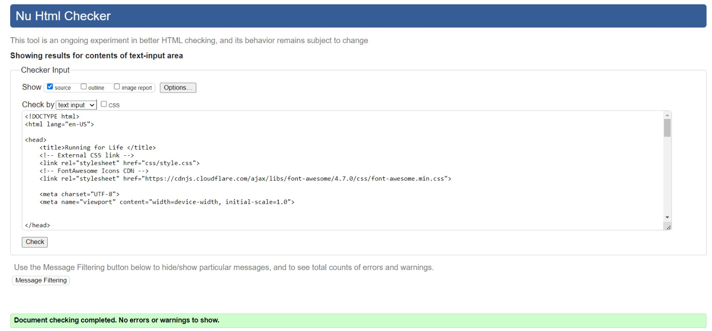
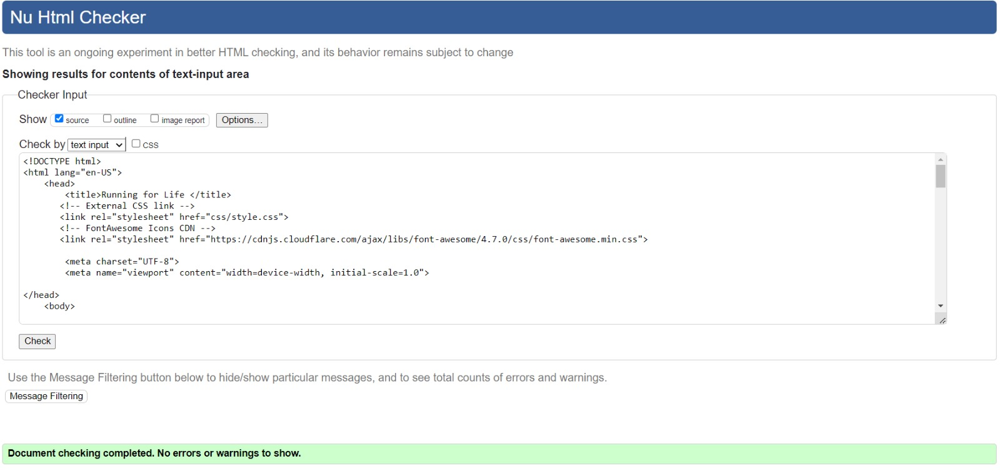
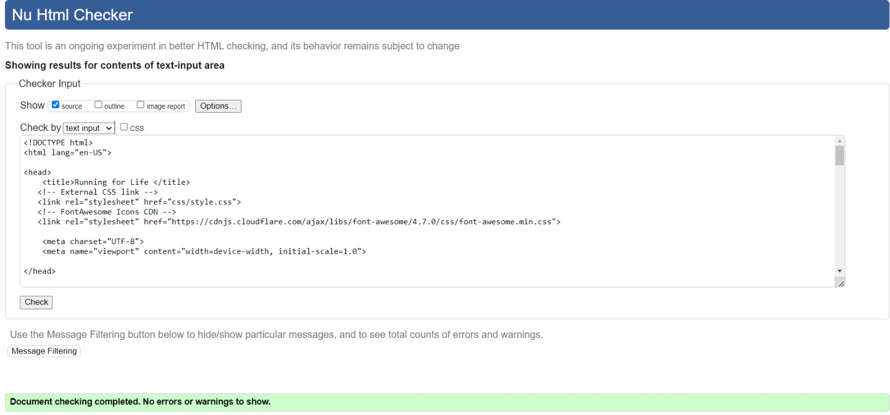

<h1 align="center">Running for Life</h1>

[View the live project here.]( )
### Purpose of the website 
Website created for anyone who is interested about running and would like to see progress of my own achievements. Content of media and tips will try to encourage others to become active.
 
  
-   ###  Goals

    -   #### Developer goals 

        1. To create easy to read page with intuitive navigation tabs to 3-4 sections.
        2. To motivate others to engage with running 
        3. To create my first page including HTML & CSS with all requirements for Milestone project 1.
        4. To create webpage and gain as many subscribers as possible for future development of website.

  
-   ###  Features

    -   #### Navigation bar included 4 navigation sections 

        1. Home – Including general information about website.
        2. About – Including more specific information about website
        3. Photos – Contain all pictures from running competitions 
        4. Video – Include running videos where user is able to control video.
        
 Social media content – This section includes all content necessary to enter social media and to fallow web developer.  
 Newsletter – Ability for user to subscribe and leave email address.  
 -   ##### Responsive on all device sizes

  
*   ### Design

    -   Main colours used in project are Gray and light Gray 

*   ### Typography

    -   font-family: Arial, Helvetica, sans-serif.
*   ### Media

    -   @media query used with 50% width to the page 
  
-   ###  Wireframes

    -   #### Technologies Used

 

### Languages Used

-   [HTML5](https://en.wikipedia.org/wiki/HTML5)
-   [CSS3](https://en.wikipedia.org/wiki/Cascading_Style_Sheets)

### Frameworks, Libraries & Programs Used

   
1. [Gitpod](https://github.com/)
    - for creating content and to push to github.
1. [GitHub:](https://github.com/)
    - Used to save projects.
1. [Google developer:]()
    - console used to check responsiveness on the website and to identify codes
1. [Balsamiq:](https://balsamiq.com/)
    - used for wireframes design.

## Testing

The W3C Markup Validator and W3C CSS Validator Services used to identify errors 

-   [W3C Markup Validator](https://jigsaw.w3.org/css-validator/#validate_by_input) - [Results](https://github.com/)
-   [W3C CSS Validator](https://jigsaw.w3.org/css-validator/#validate_by_input) - [Results](https://github.com/)

-   ###  GitHub Pages

    -   #### The project was deployed to GitHub Pages using the following steps...

        1. Log in to GitHub 
        2. At the top of the Repository (not top of page), locate the "Settings" Button on the menu.
        3. Scroll down the Settings page until you locate the "GitHub Pages" Section.
        4. Under "Source", click the dropdown called "None" and select "Master Branch".
        5. The page will automatically refresh.
        6. Scroll back down through the page to locate the now published 
        
-   ###  Credits

    -   #### All content was written by the developer.
 
        
-   ###  Content

    -   #### 
    
 -   ###  Media
  

